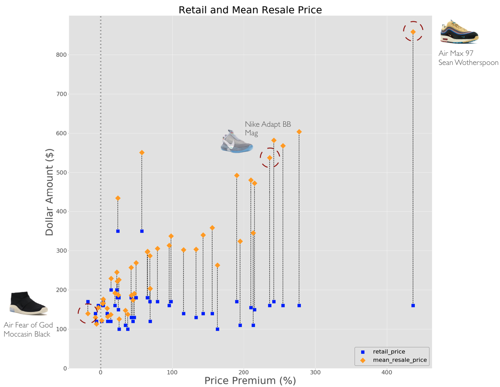
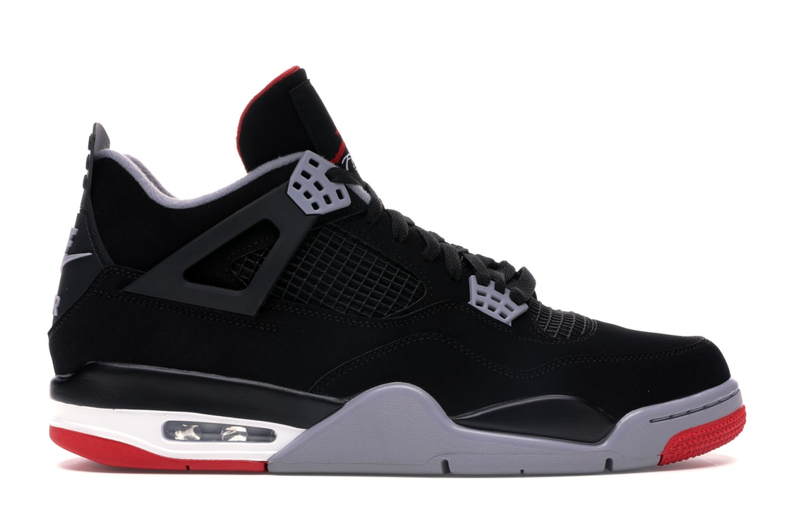
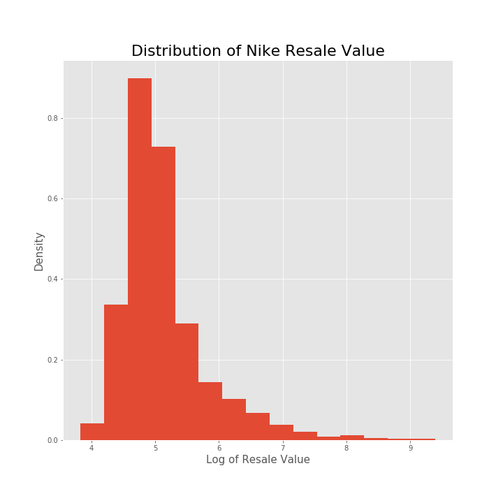
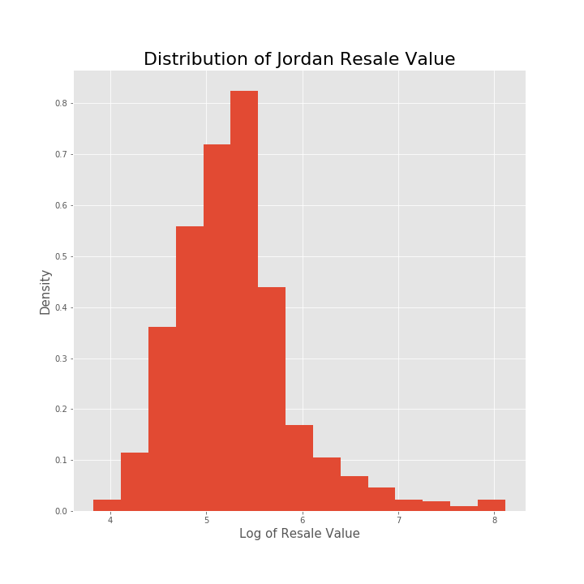

# Flip or Skip?

High profile sneakers are difficult to purchase upon their retail release. If you miss out, your only chance to purchase the sneaker is via the resale market, where the resale value can be over 400% of their original retail value! I built a model that predicts if a sneaker will resell at a profit before its release.

Are they worth purchasing to resell? (Flip)
Or should we just avoid buying them? (Skip)

##### A plot showing sneaker retail prices and resale prices for 50 Nike Sneakers

# Data Collection and Process:
I scraped data from StockX.com. Using beautiful soup, I was able to scrape 765 Jordan sneakers and 922 Nike sneakers. I removed grade school, toddler, and preschool sneakers. I was also able to scrape features of the sneakers such as:

* Name
* Colors
* Retail Cost
* Release Date
* Images
* Average Resale price 

The images were main profile views of the sneakers. Some sneakers on stockX even had 36 images of the entire sneaker.

I was able to store the images into an AWS S3 bucket while the rest of the was data was stored into a pandas data frame.

# Features for Models:
Most of the features I was able to collect for each sneaker were categorical. These features were either directly from the website data itself or extracted from the name of the sneaker.

Once my features were prepped, these are the features currently used for my model:

* m_color
* color_0
* color_1
* retro (only for jordan)
* cut (none, low, mid, high)
* Silhouette
* Day of the Week Released
* Month Sneaker was Released
* Retail Price

# Model:
### Random Forest Classifier
After working through different models, I ended up choosing Random Forests.
I first utilized a Random Forest Classifier to predict if a sneaker would flip or not. The model will output a probability of a sneaker being a flip or not.

#### Nike
| Scoring Metric| Score (%)     |
| ------------- |:-------------:|
| Accuracy      | 66.67%        |
| Precision     | 72.22%        |
| Recall        | 15.29%        |

The Nike model’s main concern is it is not predicting many sneakers to be a flip. However, the good news is my model is precise when it comes to the sneakers it has actually identified as a flip.

#### Jordan
| Scoring Metric| Score (%)     |
| ------------- |:-------------:|
| Accuracy      | 70.83%        |
| Precision     | 68.57%        |
| Recall        | 58.54%        |

The Jordan model is a bit better. The model is classifying more sneakers are a flip than the Nike model while maintaining the same amount of precision. 

### Random Forest Regressor
Predicting actual resale price: Random Forest Regressor

Using the same features as above and a Random Forest, I predicted the actual resale value of these sneakers. Unfortunately it did not do that well.

#### Nike
| Loss Function                 | Value         | 
| ------------------------------|:-------------:|
| Mean Squared Error            | 522,335.77    |
| Root Mean Absolute Error      | $722.73       |
| Mean Absolute Error           | $165.15       |

#### Jordan
| Loss Function                 | Value         |
| ------------------------------|:-------------:|
| Mean Squared Error            | 236,946.70    |
| Root Mean Absolute Error      | $486.77       |
| Mean Absolute Error           | $188.67       |

I believe this is due to my data I have collected. There are sneakers in my dataset that have extremely high resale value. My mean for Nike resale value is 253.91 with a standard diviation of 565.99. For Jordan my mean is 256.14 with a standard deviation of 312.59. My dataset is skewed when it comes to the resale values of sneakers:

Because of this, I believe my random forest regressor, which uses mean squared error as a loss function, uses the mean of the respective sneaker’s resale value. This leads to poor performance in terms of predicting the resale value.

# Analysis:
As someone that would be purchasing the sneakers at retail to make a profit reselling them, there is value here. 

For my classifying models, due to their solid precision, if my model were to classify a sneaker as a flip there is a good chance that the sneaker will. Using a more detailed look, we can go to the respective model’s ROC curves:

[IMAGE: ROC curves]

Calculating the Area Under the Curve (AUC) we get scores of 0.75286 for Nike and 0.750997 for Jordan. These are encouraging numbers and boost the confidence of a sneaker buyer to purchase at retail the sneakers my model has classified as flip.

# Next Steps:
##### More features:
All but one of my features my model currently uses are categorical. A few features I want to use for my next models are:

Social Media Impact

Images of the sneakers

Designer and collaborations

For my model for predicting the resale value of a sneaker, I want to try and remove some of the skewed data points. I believe that currently I do not have enough data to accurately predict higher price premiums. With a less skewed dataset, I hope to create a model that will accurately predict the majority of resale value seen from these sneakers. This will be a better baseline model to improve upon.